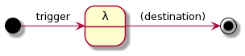

# serverless brown bag

## Intro
    - Motivation
        - levels of thing-as-a-service
        - security and cost

    - AWS Lambda
        - stateless, easy to test
        - request-response use cases
        - e.g. IFTTT
        - DEMO: MyFirstLambda
        - DEMO: Reactive Trader Cloud lambda invoke

## Serverless trading platform

    - Real-time events
    - Websocket connectivity for UI clients
    - State management when using stateless lambdas

_How do we use a serverless architecture to solve the above?_

    - DEMO: Build a functioning RFQ trading platform
        - Design architecture
        - Implement and test
        - Deployment
    
    - Acceptance criteria:
        - Trader can request to buy quantity X of instrument Y
        - Platform to auto-quote requests upon receipt
        - Trader can accept quote which executes trade
        - Trade event is broadcast to all users
        - All events audited
